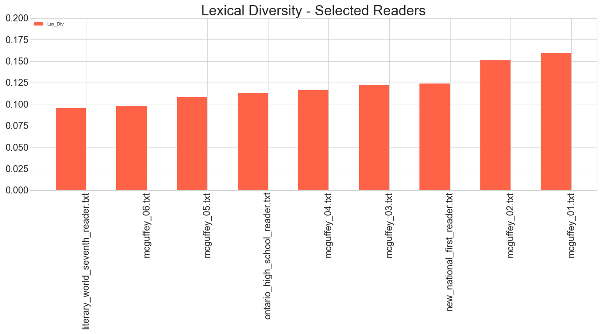
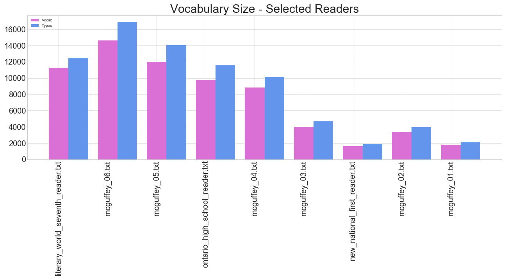
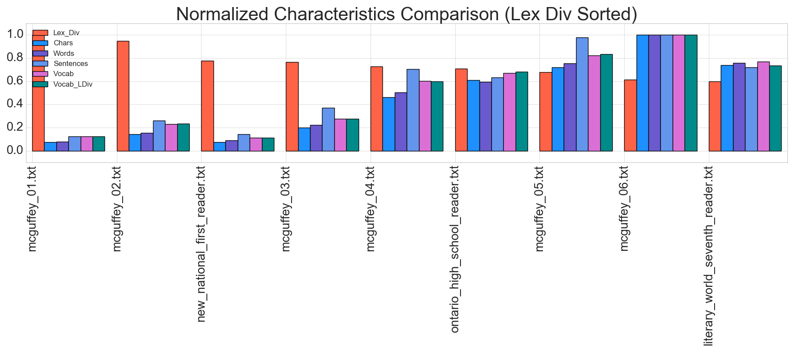
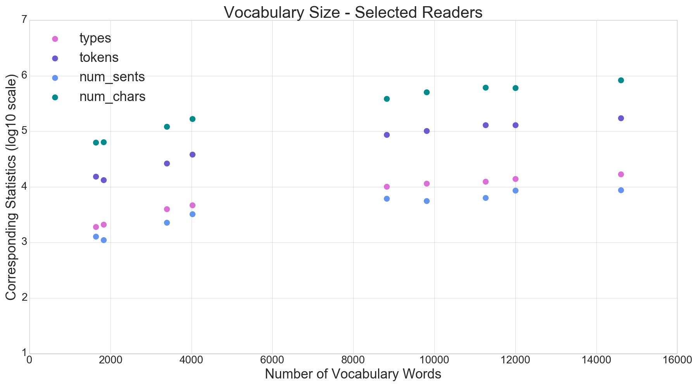
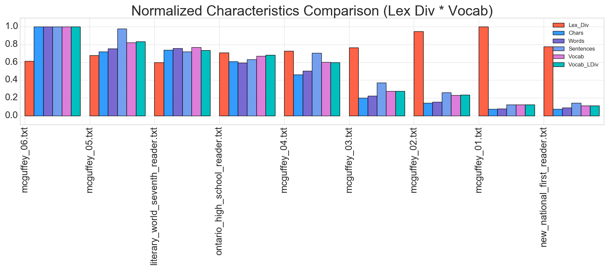

### MSDS 7337 - Natural Language Processing - Homework 01  
#### Patrick McDevitt  
#### 01-Sep-2018  

***  
## Lexical Diversity - Assignment  

For this project we are requested to :  

1. Install Python (if you don’t have it already), and install NLTK.  
2. Follow the instructions in chapter 1 of Bird-Klein for implementing a “lexical diversity” scoring routine.  
3. Go to http://www.gutenberg.org/wiki/Children%27s_Instructional_Books_(Bookshelf), and obtain three texts (of different grade levels) from the “Graded Readers” section. Report the lexical diversity score of each. Explain whether the result was surprising.  
4. Also compare the vocabulary size of the same three texts. Explain whether the result was surprising.   
5. Write a paragraph arguing whether vocabulary size and lexical diversity in combination could be a better measure of text difficulty (or reading level) than either measure is by itself.  
    
    
***  
## Lexical Diversity - Selected Texts  

In Ref [1], lexical diversity is defined as :  

$$(number \: of \: unique \: tokens) \: /  \: (number \: of \: tokens) $$
 in a given text (otherwise referred to as the __TTR__ (_type-token ratio_))

For this assignment, the lexical diversity for several of the texts from the gutenberg.org web-site is shown in below figure.  

{width=650px}\ 


#### Was the result surprising ?  
The original assignment was to select three texts from the gutenberg.org site and make this comparison. From the three originally selected texts, the sample size was not large enough to make an informed statement about whether the results met expectations. For that reason, we expanded the number of texts to nine samples, and also included all of the McGuffey readers in the sample so that there is some expectation that there will be increasing lexical diversity with increasing grade level within a set of readers produced by the same authors. So, in this plot we can observe that lexical diversity scores increase with decreasing grade level among the McGuffey readers - so, yes, this is a surprising result if lexical diversity is intended to be a robust measure of complexity of language. We can expect that a McGuffey reader of level 6 to have more complexity than a McGuffey reader of level 1.  
The lexical diversity scores obtained by this method do not meet that expectation.  

## Vocabulary Size - Selected Readers   

For this assignment, the vocabulary size for several of the texts from the gutenberg.org web-site is shown in the below figure. We observed that the base definition of lexical diversity in the Ref [1] uses the relation : len(text) / len(set(text)), but that also in the same reference the author counts vocabualry words after a conversion of all characters to lower case prior to subsetting to the unique values. These two approaches give slightly different counts for the number of vocabulary terms in these texts. For completeness, we plot both values in the below plot. As expected, there are fewer vocabulary words for the method that first converts all characters to lower case. There is a strong correspondence between the two values and does not change the overall assessment that is made, using one or the other, in this case.

{width=650px}\ 


#### Was the result surprising ?  
In the above figure, the vocabulary sizes of the various readers are shown to range from ~15,000 words (McGuffey 6) to less than 2,000 words (New National 1st Reader). The vocab sizes are ordered in ascending order of Lexical Diversity Scores (same order as the first figure). We can observe that the early grade readers, in general, have substantially less vocabulary than the higher grade readers. We can also observe that within the McGuffey series there is a monotoncially increasing number of vocabulary words with each increasing grade level.
So, no, this is not a surprising result. We expect higher grade level readers to have ever increasing number of vocabulary words.   
The vocabulary count trends obtained by this method meet that expectation.  

## Lexical Diversity and Vocabulary Size - Combined  

In the following plots we plot all of the basic metrics for each of the texts :  

* number of characters,
* number of words (tokens),
* number of sentences,
* number of vocabulary words (types),
* lexical diversity score (type/token ratio)

For these plots, each metric is normalized to 1, based on the max value of the statistic for this sample of readers.
This allows a trend comparison among these metrics, particularly in relation to the lexical diversity score. In the plot below, the values are plotted in descending order of normalized lexical diversity score. We can observe that all of the other statistics have a generally inverse relation to the lexical diversity score. As observed above, the lexical diversity score does not meet expectations in that there is increase in grade level (particularly identifiable within the set of McGuffey readers) that is contrary to the decrease in the lexical diverstiy score.

{width=650px}\ 

To respond to the question posed : "is vocabulary size and lexical diversity in combination a better measure of text difficulty than either measure is by itself ?" 

From Ref [2] & [3] it is observed that this measure of lexical diversity varies widely associated to the length of the text. For example, a text of only a few but absolutley distinct words has a 100% lexical diversity score, while a text of massive length - even one that contains all of the words in the english language - will eventually repeat words to assemble them into logical thoughts. Lexical diversity as measured by this method is not a robust measurement. There can be some value if the texts are of the same length or segments of text which have been evaluated on equal length bases.  

To understand the statistics compiled for these texts more completely, in the below plot is each of the basic statistics plotted in relation to the number of vocabulary words in the corresponding text. Vertical axis is plotted in log10 scale for clarity. We can observe for this collection, that there is nearly identical increasing trend for all statistics vs. vocabulary. For this set of texts, then, the type-token ratio does not provide a meaningful differentiator to assess lexical diversity.  

{width=650px}\ 

To provide an alternative metric we introduce another metric that provides a relative scaling among a defined set of texts to rate lexical diversity. We normalized all of the lexical diversity to 1, within this set of lexical diversity score. Similarly, we normalized all of the vocabulary sizes to 1, based on the max vocab size in this corpus. Then for a new metric, we use normalized lexical diversity * normalized vocabulary size. This value is plotted in the below figure for each of the texts, along with (again) all of the other statistics. The values are plotted in descending order of this lex_div \* vocab score (LDV). The LDV score is the cyan (~green) bar which is the furthest to the right in each grouping.

{width=650px}\ 

We can observe that there is, by this method, a monotically decreasing trend in LDV associated to decreasing grade level among the McGuffey readers. Thus, this LDV score meets expectations at that level and is an improvement over base lexical diversity score used above. Further, the New National First Reader is ranked lowest in LDV - again meeting expectations, since we observed previously that this reader has the smallest vocabulary among the texts and is also an early grade reader. The Literary World Seventh Reader and the Ontario High School Reader fall between the McGuffey 4th and 5th level readers - which is perhaps contrary to expectations, based on the titles of the readers. We would expect a high school reader to have higher complexity than a 5th or 6th level primer. This might be attributed to the eras in which these readers were compiled or again an indication of the general weakness of the lexical diversity metric. The metrics developed here do not, for instance, account for _stop words_ or _stemming_ prior to establishing the types within the corpus. These basic additional text preparation steps are likely to provide improvements in metrics to assess lexical diversity.  

***  


### References  

[1] - http://www.nltk.org/book/ch01.html  
[2] - https://www.sltinfo.com/type-token-ratio/  
[3] - https://lexically.net/downloads/version5/HTML/index.html?type_token_ratio_proc.htm


\newpage  

***  

### Appendix A - python source code  


```{r code = readLines('nltk_20180902.py'), eval = FALSE}

```


