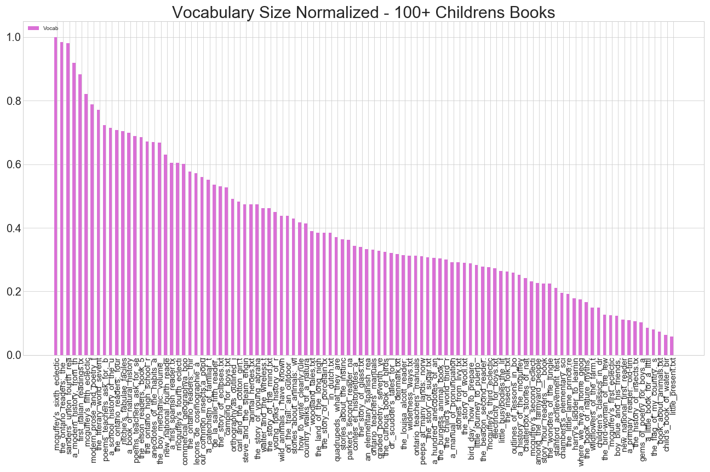
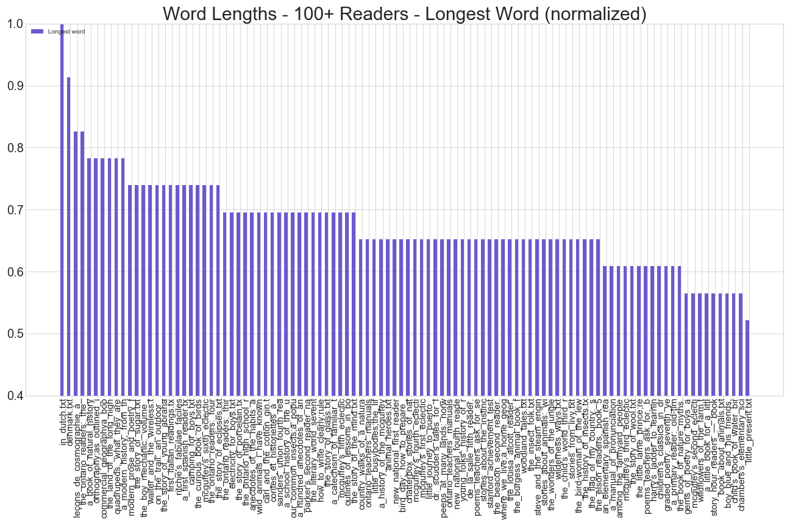
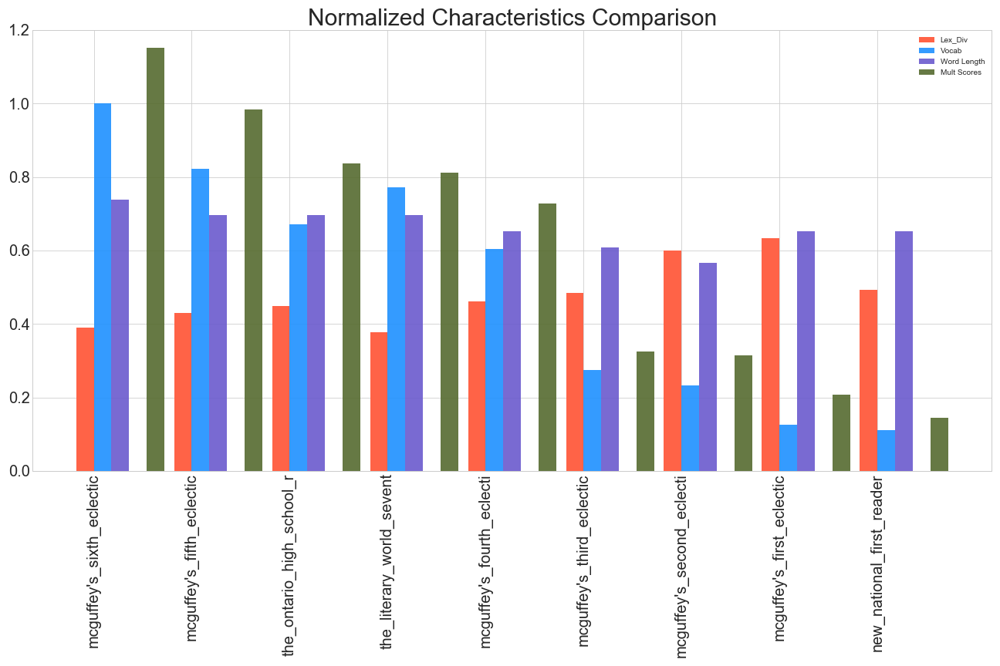

### MSDS 7337 - Natural Language Processing - Homework 02  
#### Patrick McDevitt  
#### 16-Sep-2018  

***  
## Lexical Diversity - Assignment  

For this project we are requested to :  

1. In Python, create a method for scoring the vocabulary size of a text, and normalize the score from 0 to 1. It does not matter what method you use for normalization as long as you explain it in a short paragraph. (Various methods will be discussed in the live session.)  
2. After consulting section 3.2 in chapter 1 of Bird-Klein, create a method for scoring the long-word vocabulary size of a text, and likewise normalize (and explain) the scoring as in step 1 above.  
3. Now create a “text difficulty score” by combining the lexical diversity score from homework 1, and your normalized score of vocabulary size and long-word vocabulary size, in equal weighting. Explain what you see when this score is applied to same graded texts you used in homework 1.  
    
***  
## 0 - Collect texts to create corpus   

We were recommended to used the texts from Url link: http://www.gutenberg.org/wiki/Children%27s_Instructional_Books_(Bookshelf)

The Bookshelf contains the following categories:
- Misc.
- Graded Readers
- Poetry Readers
- Readers for English Speakers Learning Other Languages
- Non-English Readers
- About Readers
- Science and Nature
- History
- Geography
- Uncategorized

In all, there are approx 104 titles identified at that collection of texts on the gutenberg.org website. To collect these texts to a local drive to faciliate the lexical processing, a python script was constructed that :  
- parses the html from the parent site to extract 2 elements :  
    - the hyperlink for each text  
    - the title of each corresponding text  
    
- the hyperlink for each text actually refers to another web page within the gutenberg domain that includes links to each different format available for each text (html, pdf, txt, etc)  
- there is a pattern evident from the 1st hyperlink that allows deconstruction and reconstruction of the url to correctly identify the url associated to the .txt version of the text  
- that link construction is completed, and subsequently all of the texts are obtained using wget within the python script  

The python code that identifies and downloads the 100+ texts from the Children's Bookshelf is included in Appendix A.  

Subsequent to the download, an additional script was executed that removes the Gutenberg licensing texts from the beginning and ending portions of the text. Since the goal of this assignment is to assess the lexical diversity of each text by several measures, including word length, it is relevant to remove the Gutenberg license from the texts to eliminate that specific vocabulary from contributing to the diversity metrics. The python code that removes the licensing text is in Appendix B.

## 1 - Vocabulary Size   

To establish a vocabulary size score for each text the following is completed :  

- each of the 100+ texts were read into memory to establish the corpus
- some basic cleaning of the to retain only aplhabetic characters was completed
- all remaining words were converted to lower case letters
- the resulting number of unique vocabulary words were counted for each of the texts independently
- the maximum vocabulary size was found in the text :
    * _McGuffey's Sixth Eclectic Reader_ with 14,611 unique words
- the vocabulary size for each text is then divided by the maximum vocabulary size (14,611) to produce the normalized vocabulary score for each text  

The range and distribution of the scores for the collection of texts is shown in below Figure 1.  

__Figure 1. - Normalized vocabulary size scores - 100+ children's texts__  

{width=650px}\ 

The python code to establish the normalized vocabulary scores is included in Appendix C.  

## 2 - Longest Words    

A similar approach to the normalized vocabulary method is used to establish a text score based on longest word length.  

* each of the 100+ texts were read into memory to establish the corpus
* some basic cleaning of the to retain only aplhabetic characters was completed
* all remaining words were converted to lower case letters
* the resulting text was searched for all words with greater than seven characters
* this subset of words was sorted in descending order by word length
* the longest word in each text is identified, along with an integer count of the number of characters in that word
* the longest word identified among all of the texts is :
    - in the text _In Dutch_ with the word _gehoorzaamheidsinstinct_ which has 23 characters
* we observe that (a) this is not an English word, but also that (b) several of the texts with longer words are in non-English language texts (French, Spanish, and Latin are also among the higher word length texts). Since the English language texts are intermingled with the non-English language texts with the 4th through 10th place word lengths, with 19 and 18 characters, we do not make adjustment for the Dutch word as being the longest word. In addition, Google Translate® indicates that this is likely 2 words : _gehoorzaamheids_ and _instinct_, but recognizing the German/Dutch language characteristic to concatenate words together to form new words, we choose to leave the word as it is, and use that as the reference longest word for the current corpus.
* the maximum word length for each text is then divided by the overall maximum word length (23) to produce the normalized longest word score for each text  

The range and distribution of the scores for the collection of texts is shown in below Figure 2.  

__Figure 2. - Normalized longest words scores - 100+ children's texts__  

{width=650px}\  

The python code to establish the normalized vocabulary scores is included in Appendix D.  

## 3 - Text Difficulty Score  


To provide an Text Difficulty Score (__TDS__) metric we introduce a metric based on the normalized lexical diversity score, vocabulary size, and max word length. We normalized all of the lexical diversity to 1, with this set of 100+ lexical diversity scores available from the same corpus as in sections 1 and 2 above. Then for a new metric, we use two different variants of combined normalized scores : simple addition of the three, and simple multiplication of the three. Between these 2 candidate TDS values, we choose the multiplication version, due to slight improvement in order ranking of the lower level grade readers within the McGuffey Readers set.  

For the eight selected texts for this evaluation, the normalized values for each measure along with the sum TDS and multiplication TDS are shown in below Table 1. The table rows are sorted in descending order based on value of the multiply TDS.  

We can observe that there is, by this method, a monotically decreasing trend in TDS associated to decreasing grade level among the McGuffey readers. Thus, this TDS score meets expectations at that level and is an improvement over base lexical diversity score used in prior evaluation. Further, the New National First Reader is ranked lowest in TDS - again meeting expectations, since we observed previously that this reader has the smallest vocabulary among the texts and is also an early grade reader. The Literary World Seventh Reader and the Ontario High School Reader fall between the McGuffey 4th and 5th level readers - which is perhaps contrary to expectations, based on the titles of the readers. We would expect a high school reader to have higher complexity than a 5th or 6th level primer. This might be attributed to the eras in which these readers were compiled or an indication that there is further room for improvement in the TDS method. The metrics developed here do not, for instance, account for _stop words_ or _stemming_ prior to establishing the types within the corpus. These basic additional text preparation steps are likely to provide improvements in metrics to assess text difficulty.  

The TDS value is also plotted in the below figure for each of the texts, along with the other statistics. The values are plotted in descending order of the TDS score. The TDS score is the green bar which is the furthest to the right in each grouping.  


__Table 1. - Normalized scores for vocab size, lexical diversity, word length, and combined__  


text_name 	                            |	vocab 	|	lex_div | word_length |	sum_scores | mlt_scores	|
------------------------------------	|	------	|	--------|-------------|------------|------------|
mcguffey's_sixth_eclectic_reader.txt 	|	1.000	|	0.389	|	0.739	|	2.129	|	0.288	|
mcguffey's_fifth_eclectic_reader.txt 	|	0.822	|	0.430	|	0.696	|	1.947	|	0.246	|
the_ontario_high_school_reader.txt 	    |	0.671	|	0.448	|	0.696	|	1.815	|	0.209	|
the_literary_world_seventh_reader.txt 	|	0.771	|	0.378	|	0.696	|	1.845	|	0.203	|
mcguffey's_fourth_eclectic_reader.txt 	|	0.604	|	0.462	|	0.652	|	1.718	|	0.182	|
mcguffey's_third_eclectic_reader.txt 	|	0.276	|	0.485	|	0.609	|	1.370	|	0.081	|
mcguffey's_second_eclectic_reader.txt 	|	0.232	|	0.600	|	0.565	|	1.397	|	0.079	|
mcguffey's_first_eclectic_reader,_   	|	0.125	|	0.633	|	0.652	|	1.411	|	0.052	|
new_national_first_reader.txt 	        |   0.112 	|   0.492 	|   0.652 	|   1.256 	|   0.036  |

__Figure 3. - Normalized scores for vocab size, lexical diversity, word length, and combined__  

{width=650px}\ 

The python code to provide the normalized combined metrics is in Appendix E.  

***  


### References  

[1] - http://www.nltk.org/book/ch01.html  

\newpage  

***  

### Appendix A - Download texts from gutenberg.org   


```{r code = readLines('collect_texts_from_gutenberg.py'), eval = FALSE}

```

\newpage  

***  

### Appendix B - Remove Gutenberg licensing information  


```{r code = readLines('remove_gutenberg_license.py'), eval = FALSE}

```

\newpage  

***  

### Appendix C - Vocabulary size normalization  


```{r code = readLines('vocab_normalization.py'), eval = FALSE}

```
\newpage  

***  
### Appendix D - Max word length normalization  


```{r code = readLines('long_words_normalization.py'), eval = FALSE}

```
\newpage  

***  
### Appendix E - Combine normalized scores for overall ranking  


```{r code = readLines('lexical_diversity_metrics.py'), eval = FALSE}

```
